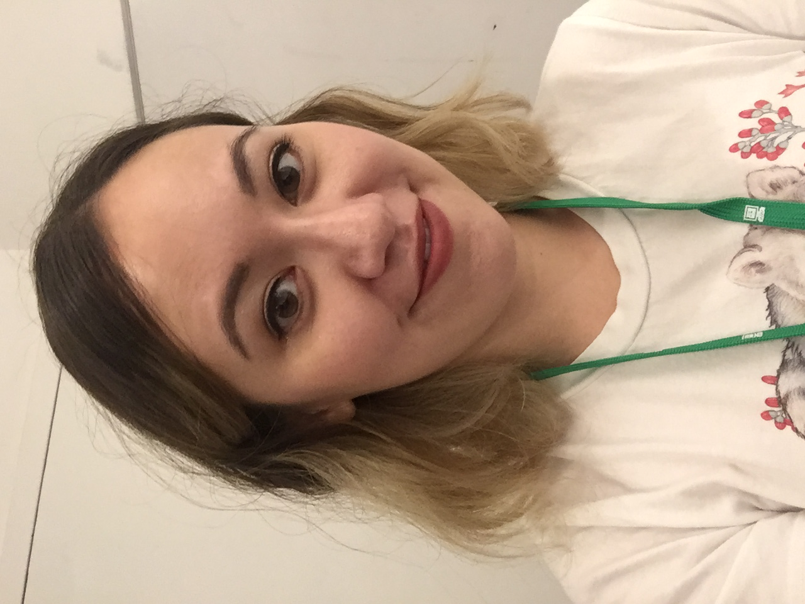

## Day 2: 
_August 15, 2017_

❌ Did not wash hair, aside from dry shampoo  
✅ Still had to blow dry... from residual shower water aaaand probably exercise sweat 😬 very attractive!

### The morning

- I did a bunch of trial runs with the curling iron *off* -- that helped!
- I solved the crinkle hair bug! Basically you have to make sure you're not wrapp hair against the curling clip. Obvious in retrospect but I can create a tutorial on this.

### The results

<iframe src="https://player.vimeo.com/video/229730684" width="640" height="360" frameborder="0" webkitallowfullscreen mozallowfullscreen allowfullscreen></iframe>

- Better curls than yesterday!!
- I think I almost mostly understand how to do the right side of my head. CAN CREATE A TUTORIAL LATER
- Uhh still struggling with the left side of my head?? I'm not sure how to twist the hair around the iron properly on the right side. Will practice this tomorrow.

### Selfie

